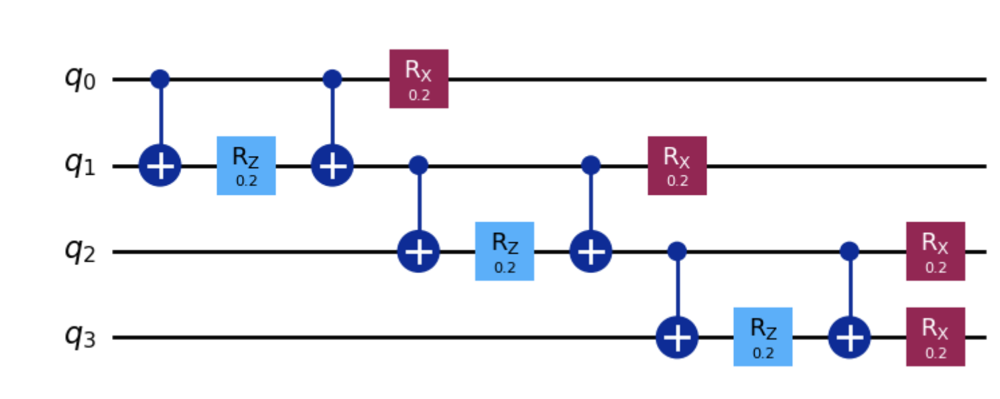
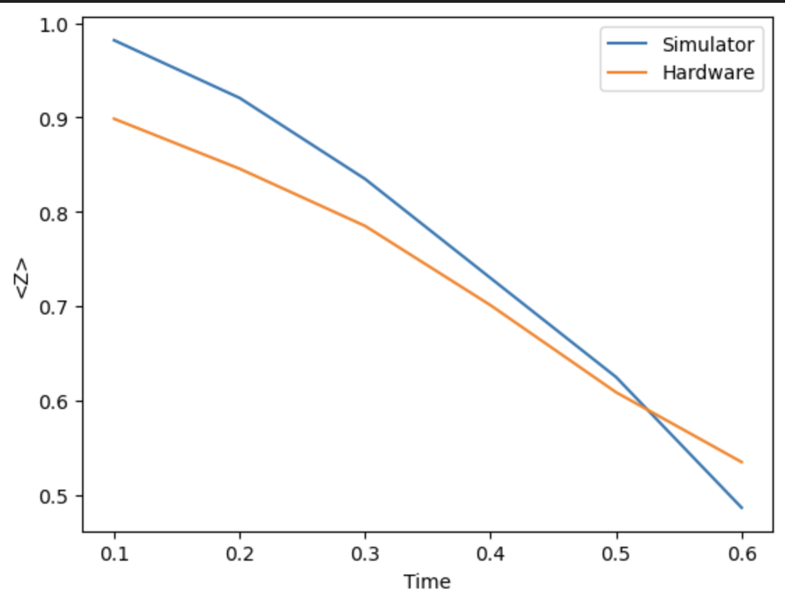
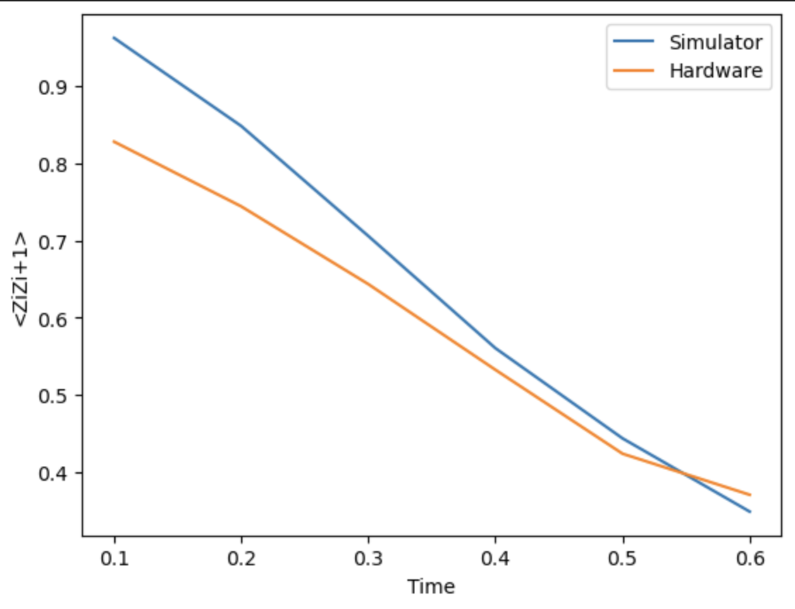
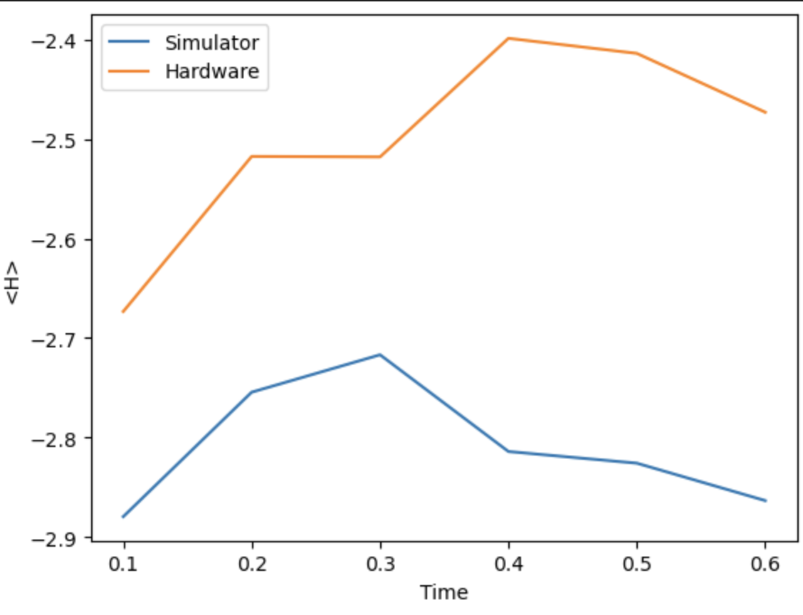

# TFIM Quantum Dynamics Simulation

A 4-qubit digital quantum simulation of the Transverse-Field Ising Model (TFIM) using Trotterized time evolution in Qiskit. This project compares quantum simulations run on both ideal simulators and real IBM quantum hardware to study many-body dynamics on NISQ devices.

## Overview

The Transverse-Field Ising Model (TFIM) is a fundamental model in quantum many-body physics that describes a chain of interacting spins subjected to a transverse magnetic field. The Hamiltonian is:

```
H = -J Σ ZᵢZᵢ₊₁ - h Σ Xᵢ
```

where:
- `J` is the coupling strength between neighboring spins (ZZ interaction)
- `h` is the transverse field strength (X field)
- The first sum represents nearest-neighbor interactions
- The second sum represents the transverse field applied to each qubit

This simulation uses Trotterization to approximate the time evolution operator and compares results between:
- **Ideal Simulator**: Noiseless quantum simulation using Qiskit Aer
- **Real Hardware**: Execution on IBM Quantum hardware with realistic noise

## Features

- **Quantum Circuit Construction**: Builds TFIM circuits using Trotterized time evolution
- **Dual Execution**: Runs simulations on both local simulator and IBM Quantum hardware
- **Observable Measurements**: Computes three key observables over time:
  - Average magnetization `<Z>`
  - Nearest-neighbor correlation `<ZᵢZᵢ₊₁>`
  - Total energy `<H>`
- **Visualization**: Plots time evolution comparing simulator vs. hardware results
- **Circuit Visualization**: Displays the quantum circuit structure

### Circuit Diagram



*The quantum circuit showing one Trotter step with ZZ interactions (CNOT + RZ gates) and transverse field rotations (RX gates).*

## Requirements

- Python 3.8+
- Qiskit
- Qiskit Aer
- Qiskit IBM Runtime
- NumPy
- Matplotlib

Install dependencies:
```bash
pip install qiskit qiskit-aer qiskit-ibm-runtime numpy matplotlib
```

## Setup

1. **Get an IBM Quantum API Token**:
   - Sign up at [IBM Quantum](https://quantum.ibm.com/)
   - Navigate to your account settings and copy your API token

2. **Configure the Notebook**:
   - Open `tfim_dynamics_simulator.ipynb`
   - In the "Backend" cell, replace the token with your IBM Quantum API key:
     ```python
     service = QiskitRuntimeService(
         channel='ibm_quantum_platform', 
         token='YOUR_API_TOKEN_HERE'
     )
     ```

## Usage

1. Open the Jupyter notebook:
   ```bash
   jupyter notebook tfim_dynamics_simulator.ipynb
   ```

2. Run all cells sequentially:
   - **Imports**: Load required libraries
   - **Parameters**: Configure simulation parameters (J, h, dt, trotter_steps, shots, qubits)
   - **Helper Functions**: Define circuit building and measurement functions
   - **Circuit Visualization**: View the quantum circuit structure
   - **Backend**: Connect to IBM Quantum and select a backend
   - **Time Evolution**: Execute the simulation
   - **Plotting**: Visualize the results

## Parameters

Default simulation parameters:

| Parameter | Value | Description |
|-----------|-------|-------------|
| `J` | 1.0 | ZZ coupling strength |
| `h` | 1.0 | Transverse field strength |
| `dt` | 0.1 s | Time step size (each Trotter step evolves for 0.1 seconds) |
| `trotter_steps` | 6 | Number of Trotter steps (total simulation time: 0.6 seconds) |
| `shots` | 4096 | Number of measurement shots |
| `qubits` | 4 | Number of qubits |

**Note**: The simulation uses 6 Trotterization steps with a time step of 0.1 seconds each, resulting in a total evolution time of 0.6 seconds. At each step, the system's observables are measured and compared between the simulator and hardware backends.

## Output

The notebook generates three plots comparing simulator and hardware results:

### 1. Average Magnetization `<Z>`
Shows collective spin direction over time.



### 2. Nearest-Neighbor Correlation `<ZᵢZᵢ₊₁>`
Shows correlation between adjacent qubits.



### 3. Energy `<H>`
Shows total system energy evolution.



*Note: The blue line represents the ideal simulator results, while the orange line shows real quantum hardware results with noise effects.*

## Physics Background

### Trotterization
The time evolution operator `exp(-iHt)` is approximated using the Trotter-Suzuki decomposition:
```
exp(-iHt) ≈ [exp(-iH_ZZ·dt) exp(-iH_X·dt)]^n
```
where `n` is the number of Trotter steps and `t = n·dt`.

### Observables
- **Magnetization**: Measures average Z expectation value across all qubits
- **Correlation**: Measures how neighboring spins are correlated
- **Energy**: Sum of interaction energy and field energy

## Project Structure

```
TFIM-Qunatum-Dynamics-Simulation/
├── README.md                        # This file
├── tfim_dynamics_simulator.ipynb    # Main simulation notebook
└── LICENSE                          # License file
```

## Notes

- Running on real IBM Quantum hardware requires queue time and may take several minutes to hours depending on backend availability
- Hardware results will show noise effects compared to ideal simulator results
- The `least_busy()` function automatically selects the most available quantum backend with at least 4 qubits

## License

This project is licensed under the terms specified in the LICENSE file.

## References

- [Qiskit Documentation](https://qiskit.org/documentation/)
- [IBM Quantum Computing](https://quantum.ibm.com/)
- [Transverse-Field Ising Model](https://en.wikipedia.org/wiki/Transverse-field_Ising_model)

## Author

Created for exploring quantum many-body dynamics on near-term quantum devices.
